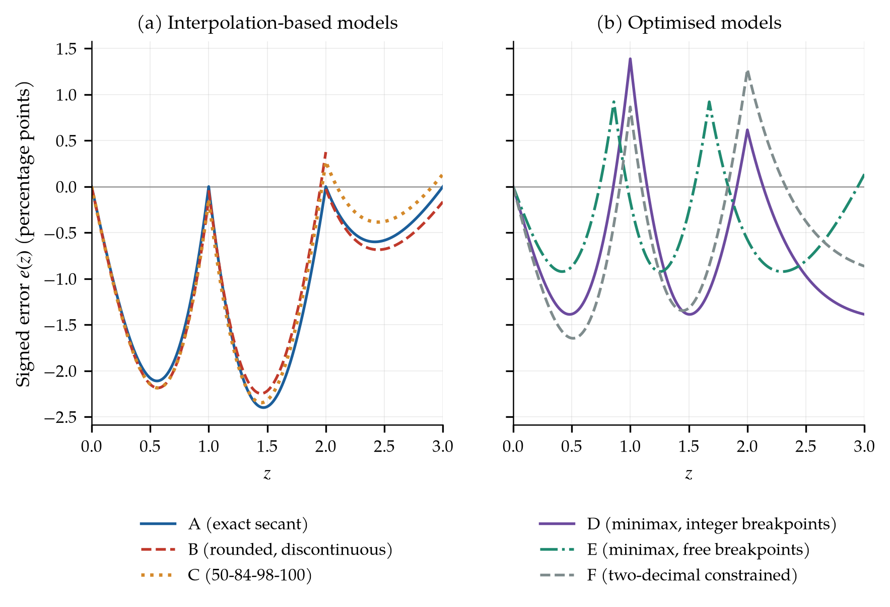

# Piecewise-Linear Approximations of the Standard Normal CDF

Companion repository for the white paper:

> Assaf, R. (2026). *Low-Complexity Piecewise-Linear Approximations of the Standard Normal CDF for Engineering Calculations: An Accuracy-Complexity Analysis.* White Paper v2.0, An-Najah National University.

**[Read the paper (PDF)](paper/Assaf_2026_PWL_Normal_CDF_v2.pdf)** · **[Open the interactive app](https://ramizassaf.github.io/normal-cdf-piecewise-linear/)** · **[Response to reviewer](REVIEW_RESPONSE.md)**

Every number in the paper comes from the code in this repository. Nothing is typed by hand: tables are generated from `results/results.json`.



## Key results (0 ≤ z ≤ 3, 30,001-point grid)

| Model | Description | Max \|e(z)\| | at z |
|---|---|---|---|
| A | Exact secant through Φ(0), Φ(1), Φ(2), Φ(3) | 0.0240 | 1.47 |
| B | Rounded version from draft v1 (discontinuous) | 0.0225 | 1.45 |
| C | Continuous two-digit nodes 0.50, 0.84, 0.98, 1.00 | 0.0235 | 1.45 |
| D | Minimax node values, integer breakpoints | 0.0139 | 1.51 |
| E | Minimax node values, free breakpoints | 0.0092 | 2.30 |
| F | Two-decimal, half-step breakpoint optimum | 0.0165 | 0.51 |
| Pólya (1949) | One closed-form line, needs exp and sqrt | 0.0031 | 1.65 |

Errors are in probability units. Multiply by 100 for percentage points (pp).

Main findings:

1. Model A underestimates Φ everywhere between breakpoints. The normal CDF is concave for z > 0, so every chord lies below the curve.
2. Choosing node values by minimax at the same integer breakpoints cuts the maximum error by 42% (Model D).
3. Counting stored constants as complexity, equal-width breakpoints with minimax node values beat free breakpoints up to seven constants.
4. CDF errors of 1 to 2 pp become tail-probability errors of 35% to 150%. At z = 2.5, Model A reports 24,100 ppm out of specification instead of 12,419 ppm. **Use these approximations for rough yield and coverage, not for defect rates.**

## Field rule (Model C)

Remember Φ at z = 0, 1, 2, 3: **0.50, 0.84, 0.98, 1.00**. Add slope × distance: 0.34 on [0,1], 0.14 on [1,2], 0.02 on [2,3]. For negative z use 1 − Φ̂(|z|). For two-sided coverage use 2Φ̂ − 1. Worst case: 2.35 pp in Φ, 4.7 pp in two-sided coverage.

Spreadsheet version (cell `A2` holds z, returns `#N/A` outside [−3, 3]):

```
=IF(ABS(A2)>3,NA(),0.5+SIGN(A2)*IF(ABS(A2)<=1,0.34*ABS(A2),IF(ABS(A2)<=2,0.34+0.14*(ABS(A2)-1),0.48+0.02*(ABS(A2)-2))))
```

## Interactive app

`docs/index.html` is a single self-contained file. Open it in any browser, offline. It plots all models against the exact CDF, shows signed error and tail error, and computes yield and ppm for your own specification limits. Drag on any chart to move z.

To serve it from GitHub Pages: Settings → Pages → Source: *Deploy from a branch* → Branch `main`, folder `/docs`.

## Reproduce

```bash
pip install -r requirements.txt
python analysis/compute_results.py   # all statistics -> results/results.json, results/error_grid.csv
python analysis/make_figures.py      # paper/figures/*.pdf, *.png
python analysis/make_tables.py       # paper/tables/*.tex (+ supplementary checks)
python app/build_app.py              # docs/index.html
pytest -q                            # 9 fast checks of the published claims
cd paper && pdflatex main.tex && pdflatex main.tex
```

The GitHub Actions workflow in `.github/workflows/build.yml` reruns the full analysis, the tests and the LaTeX build on every push to `main`, then commits the PDF, figures, tables and app. The published PDF is therefore built from the published code.

Reference CDF: `scipy.special.ndtr`, cross-checked against 50-digit `mpmath` (max difference 1.1 × 10⁻¹⁶). The app uses the Hart/West double-precision algorithm, verified against SciPy to 2.2 × 10⁻¹⁶.

## Repository layout

```
analysis/        compute_results.py, make_figures.py, make_tables.py
app/             template.html and build_app.py for the interactive app
docs/            index.html (built app, GitHub Pages root)
paper/           main.tex, generated tables/, figures/, compiled PDF
results/         results.json (every reported number), error_grid.csv
spreadsheet/     Model C formula for Excel, LibreOffice, Google Sheets
tests/           pytest checks of the main claims
```

## Changelog

**v2.0 (October 2026).** Full technical revision after peer review. All statistics recomputed from code. Corrections to v1: the maximum error of Model A is 0.0240 at z = 1.47 (v1 said 0.0215 at z = 0.5); Model B has jumps of +0.001 and −0.004 (v1 said 0.0003 and 0.0002); Model A at z = 1.5 and 2.5 is 0.9093 and 0.9880 (v1 said 0.9295 and 0.9919); four of six ppm values in the defects table were wrong; the six-segment error is 0.0071, not 0.0005; v1 validation statistics had not been computed. Added the minimax optimisation, the accuracy-complexity frontier, the tail-probability analysis, tests, and the interactive app.

**v1.0.** First draft.

## Acknowledgments

This work was prepared with the help of Claude, an AI assistant by [Anthropic](https://www.anthropic.com). Claude Haiku 4.5 assisted with the first draft. Claude Opus 5.5 carried out the technical review for v2.0: it recomputed every statistic, implemented and solved the optimisation models, produced the figures and the app, and corrected the errors listed above. The author directed the work, reviewed all content, and takes full responsibility for it. Thanks to Anthropic, and to the reviewer whose comments shaped this revision.

## Citation

See [`CITATION.cff`](CITATION.cff), or:

```
Assaf, R. (2026). Low-Complexity Piecewise-Linear Approximations of the Standard Normal CDF
for Engineering Calculations: An Accuracy-Complexity Analysis. White Paper v2.0,
An-Najah National University. https://github.com/ramizassaf/normal-cdf-piecewise-linear
```

## License

Code: MIT (see [`LICENSE`](LICENSE)). Paper text and figures: CC BY 4.0.

## Contact

Ramiz Assaf, Department of Industrial Engineering, An-Najah National University, Nablus, Palestine. ramizassaf@najah.edu
